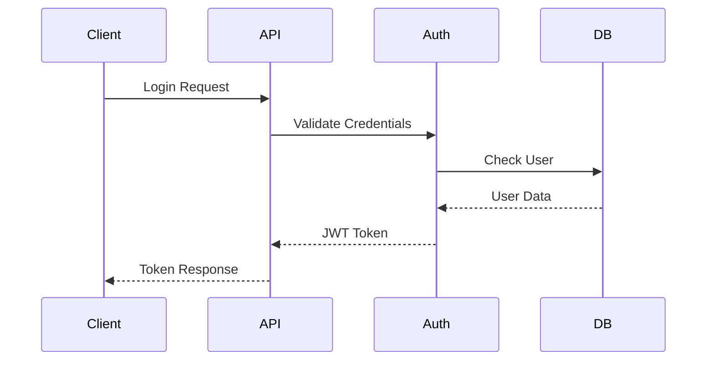

# Neighbour Approved Architectural Design Document

## Table of Contents

1. [Overview](#overview)
2. [Architecture Principles](#architecture-principles)
3. [System Components](#system-components)
4. [Implementation Details](#implementation-details)
5. [Security Architecture](#security-architecture)
6. [Testing Strategy](#testing-strategy)
7. [Deployment Strategy](#deployment-strategy)
8. [Monitoring and Observability](#monitoring-and-observability)

## Overview

Neighbour Approved is a community-driven platform enabling users to share and endorse service providers within their communities. This document outlines the technical architecture designed to support the platform's requirements for scalability, security, and maintainability.

## Architecture Principles

### Core Principles

- **Modularity:** Independent components with clear interfaces
- **Testability:** Comprehensive test coverage at all levels
- **Scalability:** Horizontal scaling capabilities
- **Maintainability:** Clear code organisation and documentation
- **Security:** Built-in security at all layers

### Design Patterns

- Repository Pattern for data access
- Service Layer Pattern for business logic
- Factory Pattern for object creation
- Strategy Pattern for flexible algorithms
- Observer Pattern for event handling

## System Components

### Layer 1: API Layer

```python
# FastAPI Application Structure
app/
├── api/
│   ├── v1/
│   │   ├── endpoints/
│   │   │   ├── communities.py
│   │   │   ├── contacts.py
│   │   │   ├── endorsements.py
│   │   │   └── users.py
│   │   ├── schemas/
│   │   └── dependencies.py
│   └── middleware/
```

### Layer 2: Service Layer

```python
# Service Layer Structure
app/
├── services/
│   ├── community_service.py
│   ├── contact_service.py
│   ├── endorsement_service.py
│   ├── user_service.py
│   └── interfaces/
```

### Layer 3: Data Access Layer

```python
# Repository Layer Structure
app/
├── repositories/
│   ├── base.py
│   ├── community_repository.py
│   ├── contact_repository.py
│   ├── endorsement_repository.py
│   └── user_repository.py
```

### Layer 4: Domain Layer

```python
# Domain Models Structure
app/
├── domain/
│   ├── models/
│   │   ├── community.py
│   │   ├── contact.py
│   │   ├── endorsement.py
│   │   └── user.py
│   └── events/
```

## Implementation Details

### API Endpoints

```python
# Example FastAPI Router Implementation
from fastapi import APIRouter, Depends
from app.services import ContactService

router = APIRouter(prefix="/contacts")

@router.get("/{contact_id}")
async def get_contact(
    contact_id: int,
    service: ContactService = Depends()
):
    return await service.get_contact(contact_id)
```

### Service Layer

```python
# Example Service Implementation
from app.repositories import ContactRepository

class ContactService:
    def __init__(self, repository: ContactRepository):
        self.repository = repository
    
    async def get_contact(self, contact_id: int):
        return await self.repository.get_by_id(contact_id)
```

### Repository Layer

```python
# Example Repository Implementation
from sqlalchemy.ext.asyncio import AsyncSession
from app.domain.models import Contact

class ContactRepository:
    def __init__(self, session: AsyncSession):
        self.session = session
    
    async def get_by_id(self, contact_id: int) -> Contact:
        return await self.session.get(Contact, contact_id)
```

## Security Architecture

### Authentication Flow



### Authorisation Framework

```python
# Permission System
from enum import Enum

class Permission(str, Enum):
    READ_COMMUNITY = "read:community"
    WRITE_COMMUNITY = "write:community"
    MANAGE_CONTACTS = "manage:contacts"
    ENDORSE_CONTACTS = "endorse:contacts"

# Usage in Endpoint
@router.post("/communities")
async def create_community(
    data: CommunityCreate,
    user: User = Depends(get_current_user),
    permissions: PermissionChecker = Depends()
):
    permissions.check(Permission.WRITE_COMMUNITY)
    return await community_service.create(data, user)
```

## Testing Strategy

### Test Structure

```python
# Example Test Implementation
import pytest
from app.services import ContactService

@pytest.mark.asyncio
async def test_contact_creation():
    # Arrange
    service = ContactService(MockRepository())
    data = ContactCreate(name="Test Contact")
    
    # Act
    result = await service.create_contact(data)
    
    # Assert
    assert result.name == "Test Contact"
```

### Testing Levels

1. **Unit Tests:** Individual components
2. **Integration Tests:** Component interactions
3. **API Tests:** Endpoint behaviour
4. **Performance Tests:** Load and stress testing

## Deployment Strategy

### Container Structure

```dockerfile
# Example Dockerfile
FROM python:3.11-slim

WORKDIR /app
COPY requirements.txt .
RUN pip install -r requirements.txt

COPY app/ app/
CMD ["uvicorn", "app.main:app", "--host", "0.0.0.0"]
```

### Environment Configuration

```python
# Configuration Management
from pydantic_settings import BaseSettings

class Settings(BaseSettings):
    DATABASE_URL: str
    JWT_SECRET: str
    ENVIRONMENT: str = "development"
    
    class Config:
        env_file = ".env"
```

## Monitoring and Observability

### Logging Framework

```python
# Structured Logging Setup
import structlog

logger = structlog.get_logger()

class LoggingMiddleware:
    async def __call__(self, request, call_next):
        logger.info(
            "request_started",
            path=request.url.path,
            method=request.method
        )
        response = await call_next(request)
        return response
```

### Metrics Collection

```python
# Prometheus Metrics
from prometheus_client import Counter, Histogram

http_requests_total = Counter(
    'http_requests_total',
    'Total HTTP requests',
    ['method', 'endpoint']
)

request_duration_seconds = Histogram(
    'request_duration_seconds',
    'Request duration in seconds',
    ['endpoint']
)
```

### Event-Driven Architecture

```python
# Event Definitions
from enum import Enum
from pydantic import BaseModel

class EventType(str, Enum):
    CONTACT_ENDORSED = "contact.endorsed"
    COMMUNITY_CREATED = "community.created"
    USER_JOINED = "user.joined"

class Event(BaseModel):
    type: EventType
    data: dict
    timestamp: datetime
    user_id: int

# Event Publisher
class EventPublisher:
    def __init__(self):
        self.subscribers = defaultdict(list)
    
    async def publish(self, event: Event):
        for subscriber in self.subscribers[event.type]:
            await subscriber(event)
    
    def subscribe(self, event_type: EventType, handler: Callable):
        self.subscribers[event_type].append(handler)
```

### Caching Strategy

```python
# Redis Cache Implementation
from redis import asyncio as aioredis

class CacheService:
    def __init__(self, redis: aioredis.Redis):
        self.redis = redis
    
    async def get_or_set(
        self,
        key: str,
        getter: Callable,
        ttl: int = 3600
    ):
        # Try to get from cache
        cached = await self.redis.get(key)
        if cached:
            return json.loads(cached)
        
        # Get fresh data
        data = await getter()
        
        # Cache the result
        await self.redis.setex(
            key,
            ttl,
            json.dumps(data)
        )
        return data
```

### Background Tasks

```python
# Task Queue Implementation
from celery import Celery

celery = Celery('neighbour_approved')

@celery.task
def update_community_metrics(community_id: int):
    """Update cached community metrics."""
    # Implementation...

@celery.task
def send_endorsement_notification(
    endorsement_id: int,
    user_id: int
):
    """Send notification for new endorsement."""
    # Implementation...
```

### Rate Limiting

```python
# Rate Limiting Implementation
from fastapi import Request
from fastapi.responses import JSONResponse

class RateLimiter:
    def __init__(self, redis: aioredis.Redis):
        self.redis = redis
    
    async def check_rate_limit(
        self,
        key: str,
        limit: int,
        window: int
    ) -> bool:
        current = await self.redis.incr(key)
        if current == 1:
            await self.redis.expire(key, window)
        return current <= limit

# Middleware Implementation
@app.middleware("http")
async def rate_limit_middleware(
    request: Request,
    call_next: Callable
):
    limiter = request.app.state.limiter
    key = f"rate_limit:{request.client.host}"
    
    if not await limiter.check_rate_limit(key, 100, 60):
        return JSONResponse(
            status_code=429,
            content={"error": "Too many requests"}
        )
    
    return await call_next(request)
```

### Circuit Breaker Pattern

```python
# Circuit Breaker Implementation
from enum import Enum
from datetime import datetime, timedelta

class CircuitState(Enum):
    CLOSED = "closed"
    OPEN = "open"
    HALF_OPEN = "half_open"

class CircuitBreaker:
    def __init__(
        self,
        failure_threshold: int = 5,
        reset_timeout: int = 60
    ):
        self.state = CircuitState.CLOSED
        self.failures = 0
        self.failure_threshold = failure_threshold
        self.reset_timeout = reset_timeout
        self.last_failure_time = None
    
    async def call(
        self,
        func: Callable,
        *args,
        **kwargs
    ):
        if self.state == CircuitState.OPEN:
            if self._should_attempt_reset():
                self.state = CircuitState.HALF_OPEN
            else:
                raise Exception("Circuit breaker is open")
        
        try:
            result = await func(*args, **kwargs)
            if self.state == CircuitState.HALF_OPEN:
                self.state = CircuitState.CLOSED
                self.failures = 0
            return result
        except Exception as e:
            self._handle_failure()
            raise e
    
    def _handle_failure(self):
        self.failures += 1
        self.last_failure_time = datetime.now()
        
        if self.failures >= self.failure_threshold:
            self.state = CircuitState.OPEN
    
    def _should_attempt_reset(self) -> bool:
        if not self.last_failure_time:
            return True
        
        reset_after = self.last_failure_time + \
            timedelta(seconds=self.reset_timeout)
        return datetime.now() >= reset_after
```

### Health Checks

```python
# Health Check Implementation
from dataclasses import dataclass
from enum import Enum

class HealthStatus(str, Enum):
    HEALTHY = "healthy"
    UNHEALTHY = "unhealthy"
    DEGRADED = "degraded"

@dataclass
class HealthCheck:
    name: str
    status: HealthStatus
    details: dict

class HealthService:
    def __init__(self):
        self.checks = []
    
    def add_check(self, check: Callable[[], HealthCheck]):
        self.checks.append(check)
    
    async def run_checks(self) -> dict:
        results = []
        overall_status = HealthStatus.HEALTHY
        
        for check in self.checks:
            try:
                result = await check()
                results.append(result)
                if result.status == HealthStatus.UNHEALTHY:
                    overall_status = HealthStatus.UNHEALTHY
                elif result.status == HealthStatus.DEGRADED and \
                     overall_status != HealthStatus.UNHEALTHY:
                    overall_status = HealthStatus.DEGRADED
            except Exception as e:
                results.append(HealthCheck(
                    name=check.__name__,
                    status=HealthStatus.UNHEALTHY,
                    details={"error": str(e)}
                ))
                overall_status = HealthStatus.UNHEALTHY
        
        return {
            "status": overall_status,
            "checks": results
        }
```
