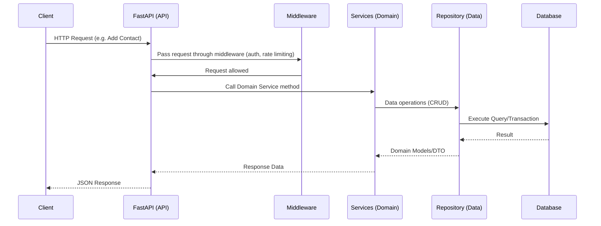

# Neighbour Approved - Detailed Architectural Design (Updated with British English & Data Types)

This document outlines the architectural design for the **Neighbour Approved** backend application, reflecting the requested updates and clarifications. Changes include using British English, ensuring the backend is modular, adopting an Extreme Programming (XP) approach, integrating a GitHub repository with a Notion task board, generating an initial list of tasks, and specifying data types for model attributes. The billing-related entities have been removed as requested.

## Table of Contents

- [Neighbour Approved - Detailed Architectural Design (Updated with British English \& Data Types)](#neighbour-approved---detailed-architectural-design-updated-with-british-english--data-types)
  - [Table of Contents](#table-of-contents)
  - [Introduction](#introduction)
  - [High-Level Architecture Overview](#high-level-architecture-overview)
  - [Layered \& Modular Architecture](#layered--modular-architecture)
    - [Presentation (API) Layer](#presentation-api-layer)
    - [Middleware Layer](#middleware-layer)
    - [Domain (Business) Layer](#domain-business-layer)
    - [Data (Persistence) Layer](#data-persistence-layer)
    - [Infrastructure Layer](#infrastructure-layer)
  - [Domain Model \& Core Entities](#domain-model--core-entities)
    - [**User**](#user)
    - [**Community**](#community)
    - [**Contact (Contractor)**](#contact-contractor)
    - [**Endorsement**](#endorsement)
    - [**SubscriptionPlan**](#subscriptionplan)
    - [**Sponsorship**](#sponsorship)
  - [Extreme Programming (XP) Approach](#extreme-programming-xp-approach)
  - [Development Flow \& Tooling](#development-flow--tooling)
  - [Diagrams](#diagrams)
    - [Layered Architecture Diagram](#layered-architecture-diagram)
    - [Request Flow Diagram](#request-flow-diagram)
  - [Future Considerations](#future-considerations)

---

## Introduction

**Neighbour Approved** aims to provide a community-driven platform for sharing endorsed contacts (contractors) within various communities. This document describes a robust, modular backend architecture. We will adopt Extreme Programming (XP) methodologies to ensure continuous feedback, high code quality, and improved team flow. Additionally, we will integrate GitHub with a Notion task board for streamlined project management.

---

## High-Level Architecture Overview

- **Technology Stack:** Python (FastAPI), PostgreSQL, SQLAlchemy, Async I/O.
- **Security & Data Protection:** JWT-based authentication, HTTPS in production, and permission checks.
- **Observability:** Structured logging, metrics, and tracing.
- **Performance:** Async endpoints, caching, indexing for database queries.
- **Scalability & Maintainability:** Clear separation of concerns, modular code structure, and XP practices to continuously refine and improve.

---

## Layered & Modular Architecture

To maintain a clean and modular codebase, we implement a layered architecture that separates concerns and facilitates independent evolution of different components.

### Presentation (API) Layer

- **Responsibilities:**
  - Expose RESTful endpoints.
  - Validate requests and return responses.
  - Provide OpenAPI/Swagger documentation automatically.
- **Tools:** FastAPI, Pydantic (for schemas), HTTPX (for testing).

### Middleware Layer

- **Responsibilities:**
  - Intercept requests/responses for cross-cutting concerns (authentication, rate limiting, logging, tracing).
- **Examples:**
  - Security middleware to verify JWT tokens.
  - Rate limiting middleware (e.g., `slowapi`).
  - Error handling middleware to standardise error responses.

### Domain (Business) Layer

- **Responsibilities:**
  - Encapsulate business logic, rules, and workflows.
  - Interact with data layer through repositories.
  - Provide services (e.g., UserService, CommunityService).

### Data (Persistence) Layer

- **Responsibilities:**
  - Manage database models and queries using SQLAlchemy.
  - Handle migrations with Alembic.
  - Provide repository classes for CRUD operations.
- **Database:** PostgreSQL or another relational DB.
- **Asynchronous DB Access:** Async SQLAlchemy + async drivers.

### Infrastructure Layer

- **Responsibilities:**
  - Configuration management with Pydantic.
  - Security utilities (hashing, token generation).
  - Observability integration (logging, metrics, tracing).
  - Utilities for caching, external API integration (future).
- **Modularity:** Each infrastructure concern lives in its own module for easy replacement or enhancement.

---

## Domain Model & Core Entities

Below are the updated domain entities with specified data types. All date/time fields are assumed to be timezone-aware where applicable, and `status` fields may be enums or simple strings.

**Note on Status Fields:**  
`status` fields could be `str` or `Enum` (e.g., `Status = Enum('active', 'inactive', 'suspended', 'expired')`). For this design, we will use strings initially and may refine to Enums as the domain stabilises.

### **User**

- `id: int`
- `email: str`
- `hashed_password: str`
- `contact_number: str`
- `first_name: str`
- `last_name: str`
- `roles: List[str]` (e.g., `["admin", "resident"]`)
- `communities: List[int]` (Foreign keys referencing Community IDs)
- `status: str` (e.g., "active", "inactive")

### **Community**

- `id: int`
- `name: str`
- `description: str`
- `public_view_enabled: bool`
- `subscription_plan_id: int` (Foreign key referencing SubscriptionPlan)
- `linked_communities: List[int]` (References to other Community IDs)
- `linked_contacts: List[int]` (References to Contact IDs)
- `status: str` (e.g., "active", "suspended")

### **Contact (Contractor)**

- `id: int`
- `community_ids: List[int]` (Many-to-many relationship to communities)
- `name: str`
- `email_address: str`
- `address: str`
- `services_offered: List[str]` (e.g., ["Plumbing", "Electrical"])
- `phone_number: str`
- `status: str` (e.g., "active", "verified", "disabled")

### **Endorsement**

- `id: int`
- `contact_id: int` (References Contact)
- `user_id: int` (References User)
- `approved: bool` (True for endorsed, False otherwise)
- `status: str` (e.g., "active", "withdrawn")

### **SubscriptionPlan**

- `id: int`
- `name: str`
- `billing_frequency: str` (e.g., "monthly", "yearly")
- `price: float`
- `renewal_date: datetime`
- `expiry_date: datetime`
- `status: str` (e.g., "active", "expired")

### **Sponsorship**

- `id: int`
- `community_ids: List[int]` (Sponsorship covers multiple communities)
- `contractor_id: int` (References Contact)
- `level: str` (e.g., "silver", "gold", "platinum")
- `start_date: datetime`
- `end_date: datetime`
- `status: str` (e.g., "active", "ended", "pending")

---

## Extreme Programming (XP) Approach

We will adopt Extreme Programming principles to ensure:

- **Continuous Integration:** Commit small changes frequently, run all tests, and keep the build green.
- **Pair Programming:** Enhance code quality and knowledge sharing.
- **Simple Design & Refactoring:** Start simple, improve structure continuously.
- **Test-Driven Development (TDD):** Write tests before production code to guide design and ensure reliability.
- **Collective Code Ownership:** Everyone owns all the code, promoting collaboration and faster improvement.

**Flow is crucial:** We will limit work in progress, focus on one feature/test at a time, and ensure fast feedback loops through CI and code reviews.

---

## Development Flow & Tooling

- **Version Control:** GitHub repository for code hosting, branching, and pull requests.
- **Task Management:** Notion task board integrated with GitHub issues.  
  - Each feature or bug fix is tracked as a task.
  - Continuous refinement of the backlog.
- **Testing:** `pytest` for tests, `pytest-asyncio` for async code, and coverage reports.
- **Linting & Formatting:** Black, Pylint, and isort for code quality.
- **Documentation:** Using docstrings, README files, and auto-generated API docs from FastAPI.

**Process:**

1. Identify a feature/test from the task board.
2. Write a failing test (TDD).
3. Implement code to pass the test.
4. Refactor if necessary.
5. Commit and push changes; CI runs tests and quality checks.
6. If all pass, merge to main.

---

## Diagrams

### Layered Architecture Diagram

```mermaid
flowchart TD
A[API Layer (FastAPI)] -->|Calls Services| B[Domain/Business Layer]
B -->|Queries/Commands| C[Data Layer (SQLAlchemy)]
C -->|Data Access| D[(Database)]
A -->|Configuration, Security| E[Infrastructure (Config, Security, Caching)]
A -->|Middleware| A
B --> E
C --> E
```

### Request Flow Diagram



---

## Future Considerations

- **Scaling to Microservices:** Potential to split out certain features (e.g., endorsements, sponsorships) into separate services.
- **Event-Driven Architecture:** Use asynchronous workers (Celery or RQ) for background tasks (e.g., notifications).
- **Integration with External APIs:** Future integration with WhatsApp API.
- **Refining Status Fields:** Migrate status strings to Enums for stricter type safety.
