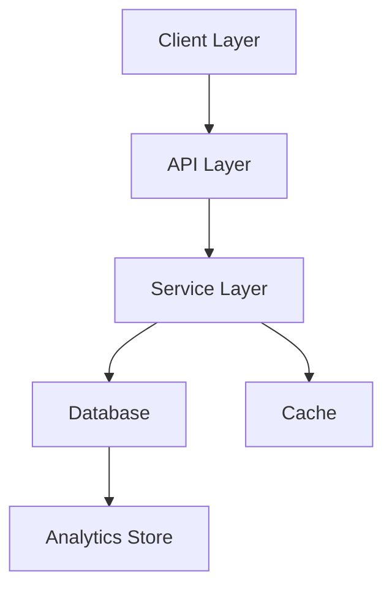
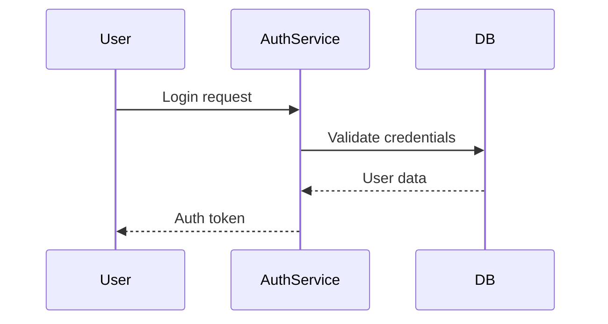
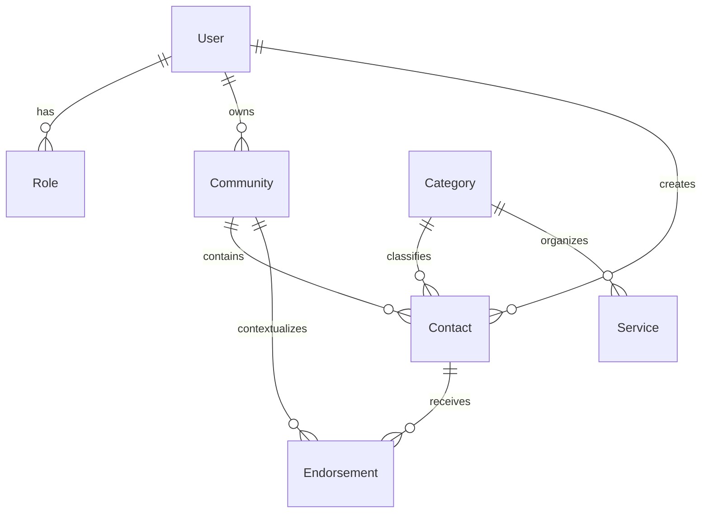
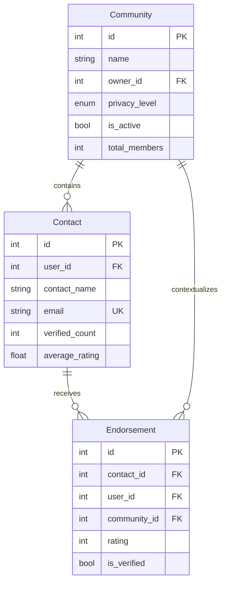
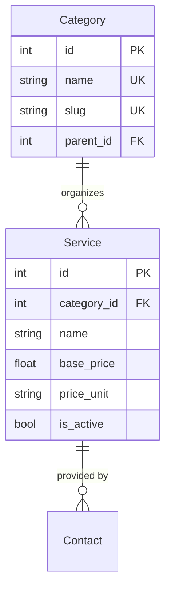

# Updated Neighbour Approved Database Design Document

## Table of Contents

1. [Overview](#overview)
2. [System Architecture](#system-architecture)
3. [Data Models](#data-models)
4. [Database Schema](#database-schema)
5. [Relationships and Constraints](#relationships-and-constraints)
6. [Performance Optimization](#performance-optimization)
7. [Audit and Security](#audit-and-security)
8. [Implementation Status](#implementation-status)

---

## Overview

Neighbour Approved's database is designed to provide a robust and scalable foundation for a community-centric platform, with PostgreSQL as the core database system. The primary objectives are:

- **Data Integrity:** Ensure consistent and reliable data across all modules.
- **Flexibility:** Support for community-based relationships, endorsements, and hierarchies.
- **Performance:** Optimized for querying, filtering, and accessing structured data.
- **Security:** Secure storage of sensitive information.

### Core Features

- Role-based access control
- Community and service management
- Hierarchical relationships
- Verification and audit tracking
- Scalable endorsement system

---

## System Architecture

### High-Level Overview



### Authentication Flow



---

## Data Models

### Entity Relationship Overview



---

## Database Schema

### User Management Schema

```mermaid
erDiagram
    User {
        int id PK
        string email UK
        string password
        string first_name
        string last_name
        bool email_verified
        datetime last_login
        bool is_active
    }
    
    Role {
        int id PK
        string name UK
        string permissions JSON
        bool is_active
    }
    
    user_roles {
        int user_id FK
        int role_id FK
    }

    User ||--o{ user_roles : "has"
    Role ||--o{ user_roles : "assigned to"
```

### Community and Contact Schema



### Service and Category Schema



---

## Relationships and Constraints

### Foreign Key Relationships

- All relationships use `ON DELETE CASCADE` where logical.
- Hierarchical relationships (e.g., categories) are tracked with `parent_id`.

### Unique and Check Constraints

1. **Unique Constraints:**
    - Emails (`User.email`, `Contact.email`)
    - Category slugs (`Category.slug` within `parent_id`)

2. **Check Constraints:**
    - Rating between 1 and 5 (`Endorsement.rating`)
    - Non-negative prices (`Service.base_price`)

---

## Performance Optimization

### Current Indices

- **Primary Indices:** Ensure fast lookups on primary keys.
- **Composite Indices:** Optimize multi-column queries, e.g., filtering endorsements by `contact_id` and `community_id`.
- **Partial Indices:** Use for active services and verified contacts.

### Query Optimization Techniques

- **Materialized Views:** For aggregations such as average ratings per contact.
- **Denormalization:** Precomputed counts for members in communities.
- **Caching:** Store frequently accessed data in a Redis cache.

---

## Audit and Security

### Security Features

1. **Authentication:**
    - Password hashing using bcrypt.
    - Tokens for session management.

2. **Data Access Controls:**
    - Role-based access to API endpoints.
    - Ownership-based access for modifying data.

3. **Encryption:**
    - Encrypt sensitive fields like emails in backups.

### Audit Features

1. **Audit Logs:**
    - Track changes to critical tables (`users`, `roles`, `communities`).
    - Log actions with `user_id`, `action`, `timestamp`.

2. **Verification Status:**
    - Status fields in contacts and endorsements.
    - Maintain verification history.

---

## Implementation Status

### Completed Items

- ✅ User and Role management
- ✅ Core schemas for Communities and Contacts
- ✅ Initial performance tuning

### Pending Improvements

1. **High Priority:**
    - Add indices for search queries.
    - Optimize JOIN-heavy queries.

2. **Medium Priority:**
    - Implement analytics dashboards.
    - Improve audit log querying.

3. **Future Considerations:**
    - Implement full-text search with PostgreSQL.
    - Explore table partitioning for large datasets.
