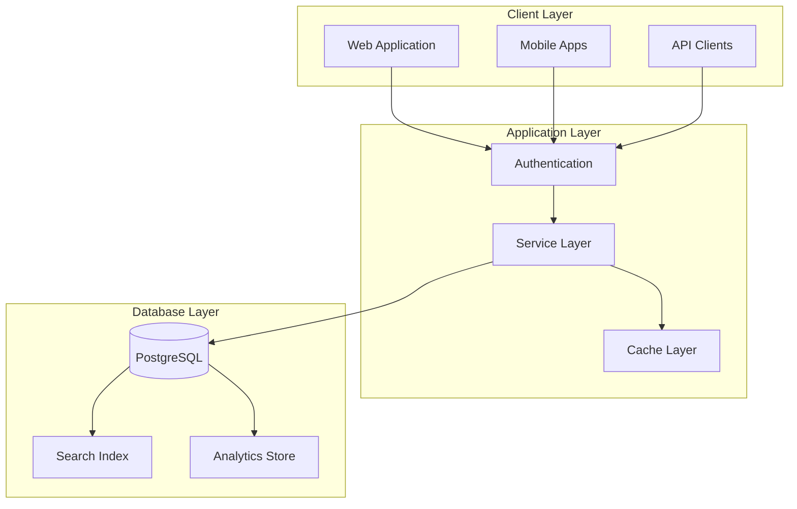
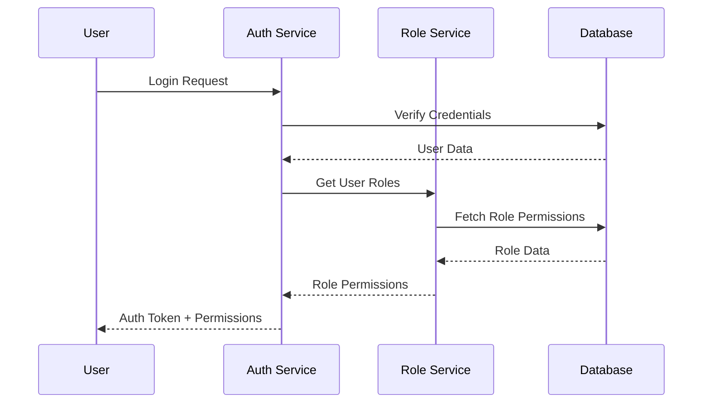
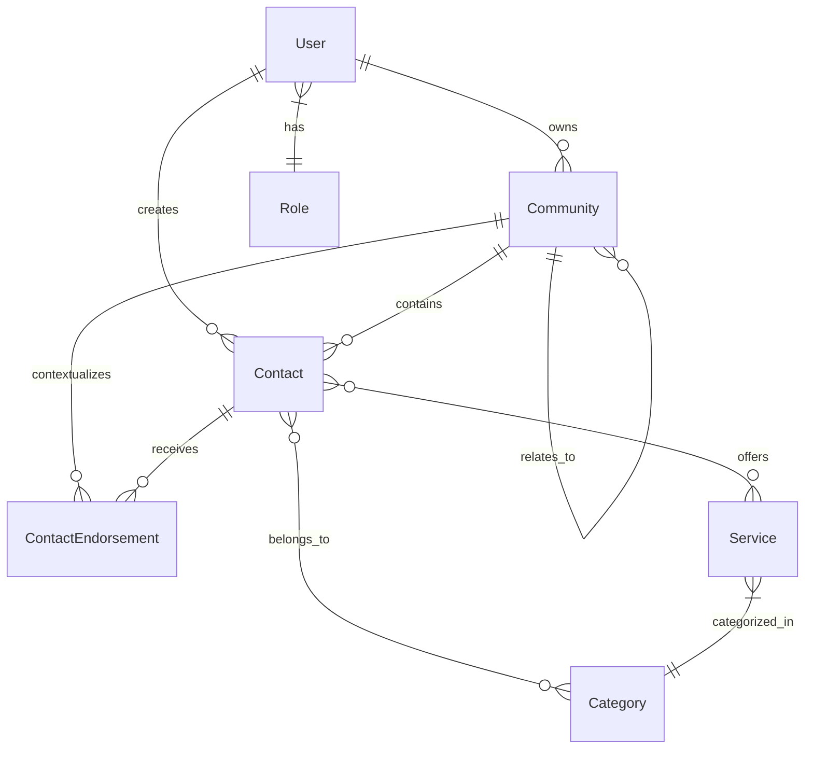
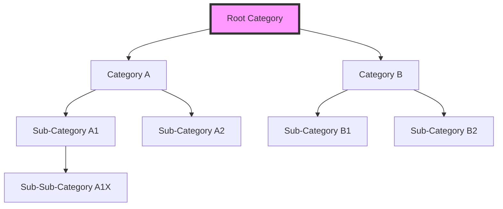
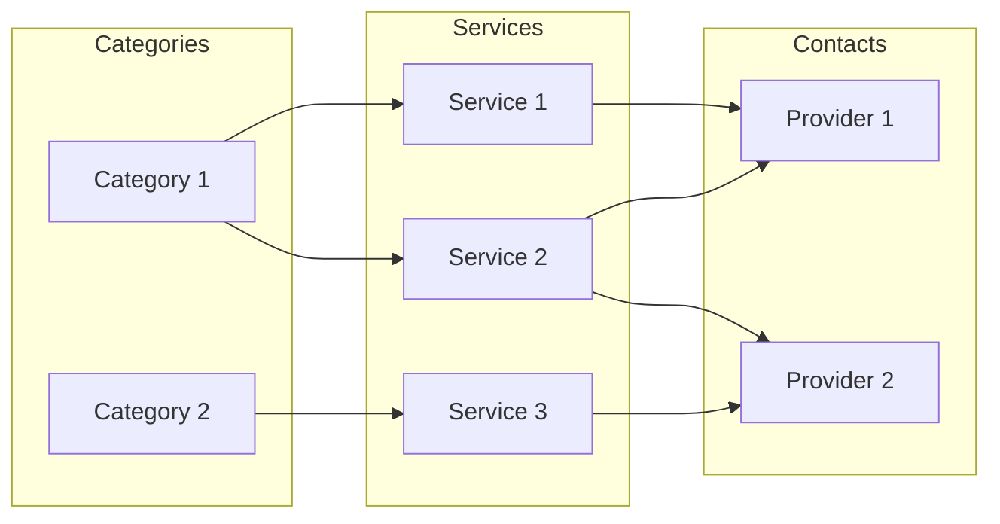
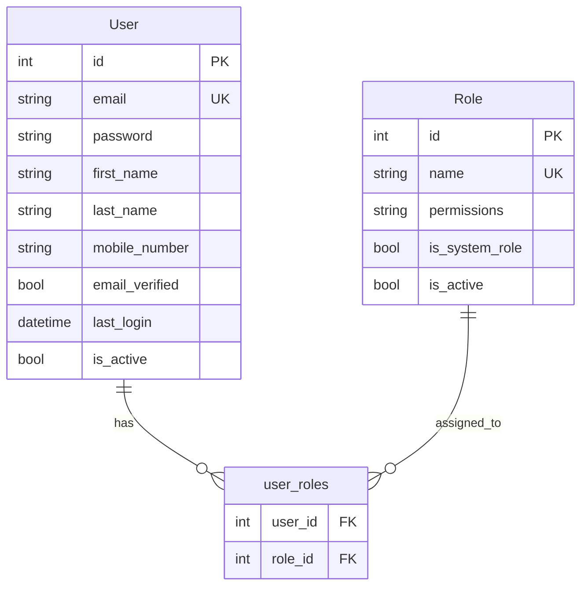
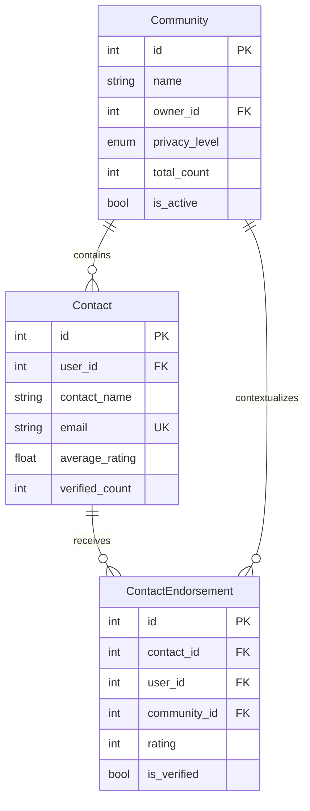

# Neighbour Approved Database Design Documentation

## Table of Contents

1. [Overview](#overview)
2. [System Architecture](#system-architecture)
3. [Data Models](#data-models)
4. [Database Schema](#database-schema)
5. [Relationships and Constraints](#relationships-and-constraints)
6. [Performance Optimization](#performance-optimization)
7. [Implementation Status](#implementation-status)

## Overview

The Neighbour Approved platform uses PostgreSQL as its primary database system, implementing a robust relational model for managing communities, users, service providers, and endorsements. The design prioritizes:

- Data integrity and consistency
- Query performance optimization
- Scalability and maintainability
- Security and access control
- Audit trail capabilities

### Core Features

- Role-based access control
- Hierarchical category management
- Community-based endorsement system
- Service provider verification
- Flexible service categorization

## System Architecture

### High-Level System View



### Authentication Flow



## Data Models

### Core Entity Relationships



### Category Hierarchy



### Service Organization



## Database Schema

### User Management Schema



### Community and Contact Schema



## Relationships and Constraints

### Foreign Key Relationships

- All relationships use `ON DELETE CASCADE` where appropriate
- Soft deletes implemented via `is_active` flags
- Hierarchical relationships tracked via self-referential foreign keys

### Data Integrity Constraints

1. Primary Key Constraints
   - All tables use auto-incrementing integer IDs
   - Composite keys used for junction tables

2. Unique Constraints
   - Email addresses (users, contacts)
   - Role names
   - Category slugs within parent

3. Check Constraints
   - Rating ranges (1-5)
   - Valid email formats
   - Valid phone numbers
   - Price validations

## Performance Optimization

### Current Indices

1. Primary Indices

   ```sql
   -- Example of primary indices
   CREATE UNIQUE INDEX idx_users_email ON users(email);
   CREATE INDEX idx_contacts_user ON contacts(user_id);
   ```

2. Composite Indices

   ```sql
   -- Example of composite indices
   CREATE INDEX idx_category_hierarchy ON categories(parent_id, path, is_active);
   CREATE INDEX idx_endorsement_context ON contact_endorsements(contact_id, community_id);
   ```

3. Partial Indices

   ```sql
   -- Example of partial indices
   CREATE INDEX idx_active_services ON services(category_id) WHERE is_active = true;
   ```

### Query Optimization

- Implemented covering indices for common queries
- Used materialized views for complex aggregations
- Optimized category tree traversal

## Implementation Status

### Completed Items

- ✅ Base schema implementation
- ✅ Core relationships
- ✅ Primary indices
- ✅ Basic constraints

### Pending Improvements

1. Critical
   - Add additional indices for name searching
   - Implement remaining check constraints
   - Complete validation rules

2. Important
   - Add materialized views for reporting
   - Implement table partitioning
   - Add performance monitoring

3. Future Considerations
   - Analytics optimizations
   - Full-text search integration
   - Caching strategy implementation

This document reflects the current state of the database design and highlights both implemented features and planned improvements. The system is designed to be extensible while maintaining data integrity and query performance.
