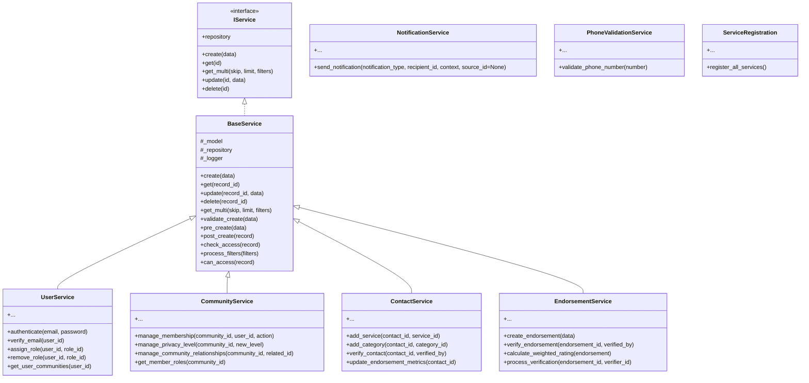
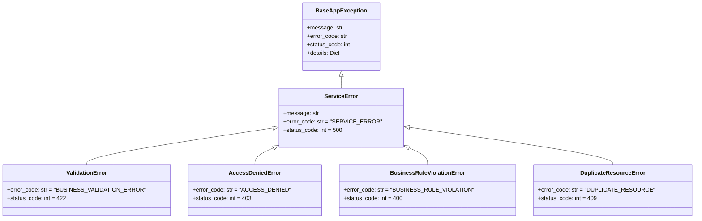

# Service Layer Specification - Neighbour Approved

## Table of Contents

- [Service Layer Specification - Neighbour Approved](#service-layer-specification---neighbour-approved)
  - [Table of Contents](#table-of-contents)
  - [Overview](#overview)
  - [Core Principles](#core-principles)
  - [Service Layer Architecture](#service-layer-architecture)
  - [BaseService and Shared Patterns](#baseservice-and-shared-patterns)
    - [Purpose](#purpose)
    - [Common Methods](#common-methods)
    - [Hook Methods](#hook-methods)
    - [Example](#example)
  - [Individual Services](#individual-services)
    - [1. **UserService**](#1-userservice)
    - [2. **CommunityService**](#2-communityservice)
    - [3. **ContactService**](#3-contactservice)
    - [4. **EndorsementService**](#4-endorsementservice)
    - [5. **NotificationService**](#5-notificationservice)
    - [6. **PhoneValidationService**](#6-phonevalidationservice)
    - [7. **ServiceRegistration**](#7-serviceregistration)
  - [Exception Hierarchy and Error Handling](#exception-hierarchy-and-error-handling)
  - [Logging](#logging)
    - [Log Levels](#log-levels)
  - [Transaction Management](#transaction-management)
    - [Behavior](#behavior)
  - [Testing Strategy](#testing-strategy)
  - [Usage Examples](#usage-examples)
    - [Creating an Endorsement](#creating-an-endorsement)
    - [Verifying an Endorsement](#verifying-an-endorsement)
    - [Assigning a Role to a User](#assigning-a-role-to-a-user)
    - [Updating Contact Metrics](#updating-contact-metrics)
    - [Adding a Member to a Private Community](#adding-a-member-to-a-private-community)
  - [Conclusion](#conclusion)

---

## Overview

The **Neighbour Approved** platform is a community-driven application that helps users share, endorse, and validate service providers within their local communities or networks. The **service layer** is a critical component in this architecture, sitting between:

- **API / Presentation Layer** (implemented via FastAPI endpoints),
- **Data Access / Repository Layer** (using SQLAlchemy-based repositories),
- **Infrastructure / External Integrations** (for example, email services, phone validation, notifications).

The service layer encapsulates **business logic**, ensuring that domain rules, validations, workflows, and cross-cutting concerns (like logging, transaction handling, and notifications) are consistently applied.

---

## Core Principles

1. **Separation of Concerns**  

   - Repositories handle only data operations (CRUD).  
   - Services handle domain logic, validation, notifications, and transaction semantics.

2. **Type Safety and Validation**  

   - Relies on Pydantic models or typed function signatures for incoming data.  
   - Enforces domain-specific validations (for example, rating ranges, membership constraints).

3. **Comprehensive Error Handling**  

   - Domain-level exceptions: `ValidationError`, `DuplicateResourceError`, `ResourceNotFoundError`, `StateError`, and so on.  
   - All exceptions are logged with `structlog` to provide contextual details.

4. **Structured Logging**  

   - Each service acquires a `_logger`, binding relevant operation details (like user_id, contact_id).  
   - Uses `DEBUG` logs for deeper developer-level insights, `INFO` for normal events, and `ERROR` for failures.

5. **Transaction Management**  

   - Multi-step operations are typically wrapped in a transaction. If any step fails, changes are rolled back.  
   - Uses `transactional` or `async_transactional` decorators, or manual session usage.

6. **Security & Authorization**  

   - Some services enforce roles or ownership checks before updates/deletes.  
   - More complex authorization typically occurs at the API layer or specialized methods.

7. **Testability**  

   - Each service is tested with both unit and integration tests.  
   - Tests reside in the dedicated test files in the repository, ensuring coverage of success/failure flows.

---

## Service Layer Architecture

Below is a simplified class diagram:



- **BaseService** is a parameterized base class that implements common CRUD. Subclasses build on it to add domain rules.

- **UserService**, **CommunityService**, etc. each have specialized business logic.

---

## BaseService and Shared Patterns

### Purpose

`BaseService` is a generic, abstract service offering standard CRUD and business-level hooks. It leverages typed generics for Model and Schemas (for instance, `model`, `create_schema`, `update_schema`, etc.).

### Common Methods

- **`create(data)`**  

  - Accepts a creation schema instance (Pydantic).  
  - Calls `validate_create(data)` or other domain checks.  
  - Inserts the new entity into the database, logs success, and returns the created record.

- **`get(record_id)`**  

  - Retrieves a record or raises `ResourceNotFoundError` if the record is absent.

- **`update(record_id, data)`**  

  - Merges changes, performs domain validations, and returns the updated entity.

- **`delete(record_id)`**  

  - Often soft-deletes or physically removes the entity, depending on the domain model’s rules.

- **`get_multi(skip, limit, filters)`**  

  - Returns a list of records with pagination and optional filter handling.

### Hook Methods

1. **`validate_create(data)`**  
   - Override for domain-specific validations prior to creation.

2. **`pre_create(data)`**  
   - Called just before instantiating the model (for transformations, auto fields, etc.).

3. **`post_create(record)`**  
   - Invoked right after creation, e.g. for sending notifications or other side effects.

4. **`check_access(record)`**  
   - Optional method to verify the current user’s permission on a record.

5. **`process_filters(filters)`**  
   - Mechanism for advanced query filtering.

### Example

```python
class UserService(BaseService[User, UserCreate, UserUpdate, UserRead]):
    def validate_create(self, data: UserCreate):
        if not data.email:
            raise ValidationError("Email is required.")
        # Additional domain logic
```

---

## Individual Services

### 1. **UserService**

**Location**: `app/services/user_service/...`

**Purpose**: Orchestrates user-centric operations, including:

- **Authentication** (`authenticate(email, password)`)  

  - Leverages hashing libraries (for example, `bcrypt`) to validate passwords.  
  - Raises `AuthenticationError` if credentials fail.

- **Email Verification** (`verify_email(user_id)`)  

  - Ensures user is eligible for verification (for example, fully onboarded, active).  
  - If already verified, logs and returns.  
  - If newly verified, sets `email_verified = True` and logs success. Optionally triggers post-verification tasks.

- **Role Management** (`assign_role`, `remove_role`)  

  - Assigns or removes roles for a user, checking duplication or a minimum number of roles.  
  - May raise `ResourceNotFoundError` if the role is invalid.  
  - Could raise `BusinessRuleViolationError` if removing a role violates domain rules (like needing at least one role).

- **User Lifecycle**  

  - Covers profile creation, updates, and additional security checks.

**Key Implementation Points**:

- Often split into submodules:
  - `user_service_authentication.py` for login flows  
  - `user_service_role.py` for role assignment  
  - `user_service_email_verification.py` for verifying eligibility, post-verification roles

**Tests**:

- Refer to the dedicated user service tests in the repository, which cover:
  - Valid/invalid passwords  
  - Duplicate role assignment  
  - Minimum role constraints  
  - Email verification edge cases

---

### 2. **CommunityService**

**Location**: `app/services/community_service/...`

**Purpose**: Oversees community lifecycle, membership, relationships, and privacy settings.

**Sample Methods**:

- **`manage_membership(community_id, user_id, action, role="member")`**  

  - Action could be "invite," "accept," or "remove."  
  - Checks if the user is active and not already a member (or if removing, ensures membership is valid).  
  - Updates `total_count` and `active_count`.

- **`manage_privacy_level(community_id, new_level, updated_by)`**  

  - Alters privacy to `public`, `private`, or `invitation_only`.  
  - Raises `ValidationError` if certain transitions are disallowed.

- **`manage_community_relationships(community_id, related_id)`**  

  - Links communities (for example, as parent-child or partner).  
  - Avoids duplicate or cyclical relationships.

- **`get_member_roles(community_id)`**  

  - Retrieves roles for each member within the community.

**Common Validations**:

- Community must be active to alter membership.  
- User must not already be a member.  
- If “private,” the user can only join via invite.

**Tests**:

- Found in `test_community_service_*.py` in the repository, including membership, privacy, relationships, and so on:
  - Verifies membership updates and role checks  
  - Tests privacy transitions and membership counts

---

### 3. **ContactService**

**Location**: `app/services/contact_service/...`

**Purpose**: Manages “contact” records — generally service providers that users can endorse.

**Responsibilities**:

- **Service and Category Associations**  

  - `add_service(contact_id, service_id)` to link offered services.  
  - `add_category(contact_id, category_id)` to categorize the contact.

- **Verification**  

  - `verify_contact(contact_id, verified_by)` marks a contact as verified, logs an audit, and may trigger notifications.

- **Endorsement Metrics**  

  - `update_endorsement_metrics(contact_id)` recalculates totals, verified endorsements, and average rating.  
  - Stores these metrics on the contact record.

- **Validation**  

  - Ensures valid phone/email.  
  - Checks user ownership if necessary.

**Implementation Notes**:

- Submodules like `contact_service_validation.py`, `contact_service_endorsement.py` handle domain-specific tasks.  
- Often calls `ContactEndorsementRepository` for endorsement data.

**Tests**:

- Located in `test_contact_service_*.py` in the repository:
  - Check correct associations with categories and services  
  - Confirm endorsement metrics update properly

---

### 4. **EndorsementService**

**Location**: `app/services/endorsement_service/...`

**Purpose**: Handles endorsements of contacts, applying domain rules such as rating range, verification steps, and duplicate checks.

- **`create_endorsement(data: ContactEndorsementCreate)`**  

  1. Validates contact, community, rating range, and comment length.  
  2. Ensures the user hasn’t already endorsed the same contact/community pair.  
  3. Creates the endorsement, logs success.  
  4. Calls `_update_contact_metrics(contact_id)` to update aggregated statistics.

- **Rating Calculation**  

  - Moved to a `RatingMixin` in `endorsement_service_rating.py`, with a method `calculate_weighted_rating(endorsement)`.  
  - Involves factors such as time decay, user reputation, community trust, and any seasonal multipliers.

- **Verification**  

  - `verify_endorsement(endorsement_id, verified_by)` checks existing verification status.  
  - If newly verified, triggers `_send_verification_notifications(...)`.

- **Notifications**  

  - Implemented in a `NotificationMixin` in `endorsement_service_notifications.py`.  
  - Dispatches notifications after verification or rating events.

- **Duplicate Prevention**  

  - Raises `DuplicateResourceError` if a user attempts an identical endorsement again.

**Tests**:

- In `test_endorsement_service_*.py` in the repository:
  - Validate rating boundaries, time-based weighting, or pending verifications  
  - Confirm notifications are dispatched as expected

---

### 5. **NotificationService**

**Location**: `app/services/notification_service.py`

**Purpose**: Central dispatcher for domain-specific notifications.

- **`send_notification(notification_type, recipient_id, context, source_id=None)`**  

  - May send email, push, or in-app messages depending on type.  
  - Could leverage external queues or direct external services.

- Often used in `EndorsementService` for verification or rating updates and in `CommunityService` for membership invites.

**Tests**:

- Located in `test_notification_service.py` within the repository, verifying:
  - Correct dispatching of notifications  
  - Proper handling of external or mocked integration

---

### 6. **PhoneValidationService**

**Location**: `app/services/phone_validation_service.py`

**Purpose**: Standardizes and validates phone numbers, for instance via `phonenumbers`.

- **`validate_phone_number(number)`**  

  - Returns E.164 format or raises `ValidationError` if invalid.  
  - Could also incorporate region checks or spam detection.

**Tests**:

- In `test_phone_validation_service.py` in the repository:
  - Validates correct handling of normal/invalid phone data

---

### 7. **ServiceRegistration**

**Location**: `app/services/service_registration.py`

**Purpose**:

- Optionally instantiates all relevant services, injecting dependencies (database sessions, caches, etc.).  
- In some designs, acts like a simple IoC container.

**Example**:

```python
def register_all_services():
    db_session = ...  # create or retrieve session
    user_service = UserService(db_session)
    community_service = CommunityService(db_session)
    ...
    return user_service, community_service, ...
```

---

## Exception Hierarchy and Error Handling

The system uses a range of domain-specific exceptions, derived from `BaseAppException`. For example:



1. **`ValidationError`**  

   - Triggered by business or input validation failures (for example, rating out of range or missing fields).

2. **`DuplicateResourceError`**  

   - Occurs when trying to create a unique resource that already exists (like endorsing the same contact/community pair twice).

3. **`BusinessRuleViolationError`** or `StateError`  

   - Thrown if the domain logic doesn’t permit an operation in the current state (for example, verifying an already verified endorsement).

4. **`ResourceNotFoundError`**  

   - Common for a missing ID in the database.

5. **Generic**  

   - `ServiceError` is a fallback for unforeseen issues.  
   - `AccessDeniedError` signals insufficient permissions or role checks.

Example usage in a service method:

```python
if not contact or not contact.is_active:
    raise ValidationError("Contact is not active or missing.")
```

---

## Logging

- Services typically set `_logger = structlog.get_logger("<ServiceName>")` or pass `logger_name` to `BaseService`.

- Important events like creation or verification are logged with relevant context:

```python
self._logger.info(
    "endorsement_created",
    endorsement_id=endorsement.id,
    contact_id=data.contact_id,
    user_id=data.user_id,
)
```

### Log Levels

- **`DEBUG`**: Details for developers (for instance, rating calculations or step-by-step membership changes).  
- **`INFO`**: Normal operations (like user creation, membership updates).  
- **`WARNING`**: Potential issues or suspicious states.  
- **`ERROR`**: Operational or domain failures.  
- **`CRITICAL`**: Rare, for system-wide or unrecoverable scenarios.

The associated tests often assert logs with the expected messages or data.

---

## Transaction Management

Numerous service methods involve multi-step database operations. Approaches:

1. **Manual**:

   ```python
   with db_session.begin():
       # multiple writes
       # if any fail, the entire block is rolled back
   ```

2. **Decorators**:

   - `@transactional` for synchronous methods  
   - `@async_transactional` for async methods

### Behavior

- If an exception surfaces, changes are rolled back.  
- If successful, the transaction is committed.

**Example** in `EndorsementService` (pseudocode):

```python
@async_transactional
async def create_endorsement(self, data: ContactEndorsementCreate) -> ContactEndorsement:
    self._validate_endorsement_creation(data)
    endorsement = await super().create(data)
    await self._update_contact_metrics(endorsement.contact_id)
    return endorsement
```

---

## Testing Strategy

The repository contains dedicated test modules for each service, covering unit and integration scenarios.

1. **Unit Tests**  

   - Validate method-level correctness, often mocking the database or external calls.  
   - For example, rating tests in `test_endorsement_service_rating.py` might verify the weighting logic of `calculate_weighted_rating()`.

2. **Integration Tests**  

   - Leverage ephemeral or test databases.  
   - Possibly use real (or mocked) external services (for example, notifications).

3. **Coverage**  

   - The goal is typically high coverage for critical modules (approaching 90% or more).  
   - Ensures stable, regression-resistant code.

**Common Patterns**:

- **`test_user_service_authentication.py`** checks credentials (valid vs. invalid).  
- **`test_community_service_relationships.py`** ensures no cyclical community links.  
- **`test_contact_service_endorsement.py`** checks endorsements, verifying metrics get updated.  
- **`test_endorsement_service_verification.py`** confirms endorsement verification logic, including repeated verifications.

---

## Usage Examples

### Creating an Endorsement

```python
from app.services.endorsement_service import EndorsementService
from app.api.v1.schemas.contact_endorsement_schema import ContactEndorsementCreate

service = EndorsementService(db_session)
data = ContactEndorsementCreate(
    contact_id=123,
    community_id=50,
    user_id=999,
    rating=5,
    comment="Amazing service, highly recommended!"
)
endorsement = await service.create_endorsement(data)
print(endorsement.id, endorsement.rating, endorsement.comment)
```

### Verifying an Endorsement

```python
endorsement_id = 789
verifier_id = 42
await service.verify_endorsement(endorsement_id, verifier_id)
```

### Assigning a Role to a User

```python
from app.services.user_service.user_service_role import RoleService

role_service = RoleService(db_session)
await role_service.assign_role(user_id=10, role_id=2)
```

### Updating Contact Metrics

```python
from app.services.contact_service import ContactService

contact_service = ContactService(db_session)
await contact_service.update_endorsement_metrics(contact_id=123)
```

### Adding a Member to a Private Community

```python
from app.services.community_service import CommunityService

community_service = CommunityService(db_session)
await community_service.manage_membership(
    community_id=5,
    user_id=10,
    action="invite"
)
```

---

## Conclusion

The **Neighbour Approved** service layer emphasizes clarity, maintainability, and robust domain logic. Each service class:

- Inherits consistent CRUD and logging patterns from **`BaseService`**  
- Embeds specialized methods to handle domain rules (for example, roles, endorsements, membership)  
- Cooperates with repositories for data and other services for cross-domain tasks (notifications, phone validations)  
- Implements structured logging and explicit exception handling for transparency and consistency

Following these patterns:

- Keeps new features aligned with existing designs (extending `BaseService` or introducing new logic modules)  
- Ensures domain validations, transaction boundaries, logging, and notifications remain systematic  
- Maintains thorough test coverage, ensuring reliability and easy enhancements
