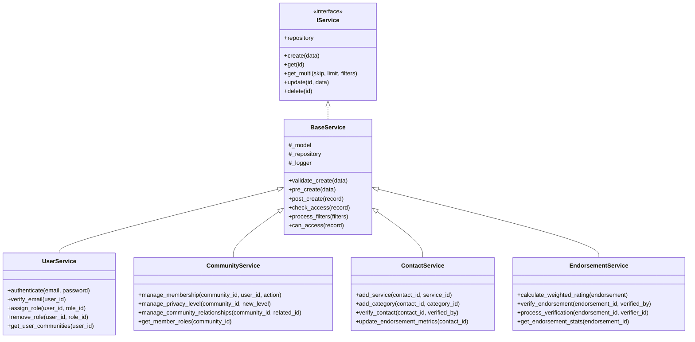
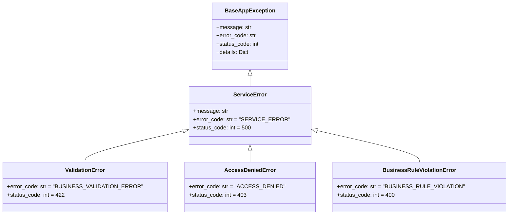

# Service Layer Specification - Neighbour Approved

## Overview

The service layer of the Neighbour Approved application provides a comprehensive business logic implementation layer that sits between the API endpoints and the data access layer. It encapsulates all business rules, workflows, and complex operations while maintaining a clear separation of concerns.

## Core Principles

1. **Separation of Concerns**: All business logic resides in the service layer, keeping repositories focused on data access
2. **Type Safety**: Comprehensive type hints and validation throughout the service layer
3. **Error Handling**: Structured exception hierarchy with specific error types
4. **Logging**: Detailed logging of all operations and state changes
5. **Transaction Management**: Proper handling of database transactions
6. **Validation**: Business rule validation separate from schema validation
7. **Authorization**: Business-level access control implementation

## Service Layer Architecture



## Exception Hierarchy



## Service Implementations

### UserService

The `UserService` handles all user-related business logic including authentication, role management, and user lifecycle operations.

#### Key Features

- User authentication and password handling
- Email verification workflows
- Role assignment and management
- User profile management
- Authentication history tracking

#### Example Usage

```python
user_service = UserService(db)

# Authentication
user = await user_service.authenticate("user@example.com", "password")

# Role management
await user_service.assign_role(user_id=1, role_id=2)

# Email verification
await user_service.verify_email(user_id=1)
```

#### Key Methods

| Method | Description | Returns |
|--------|-------------|---------|
| `authenticate` | Authenticate user with credentials | Optional[User] |
| `verify_email` | Mark user's email as verified | bool |
| `assign_role` | Assign role to user | Optional[User] |
| `remove_role` | Remove role from user | Optional[User] |
| `get_user_roles` | Get user's active roles | List[Role] |

### CommunityService

The `CommunityService` manages community operations including membership, privacy controls, and relationships between communities.

#### Key Features

- Membership management with roles
- Privacy level control and validation
- Community relationship management
- Member activity tracking
- Community metrics calculation

#### Example Usage

```python
community_service = CommunityService(db)

# Manage membership
await community_service.manage_membership(
    community_id=1,
    user_id=2,
    action="invite",
    role="member"
)

# Update privacy level
await community_service.manage_privacy_level(
    community_id=1,
    new_level=PrivacyLevel.PRIVATE,
    updated_by=1
)
```

#### Key Methods

| Method | Description | Returns |
|--------|-------------|---------|
| `manage_membership` | Handle member operations | bool |
| `manage_privacy_level` | Update privacy settings | Community |
| `manage_community_relationships` | Manage related communities | bool |
| `get_member_roles` | Get community member roles | List[Tuple[int, str]] |

### ContactService

The `ContactService` handles contact management including endorsement calculations, verification workflows, and service associations.

#### Key Features

- Service and category associations
- Endorsement metric calculations
- Contact verification workflows
- Rating aggregation
- Contact statistics

#### Example Usage

```python
contact_service = ContactService(db)

# Add service association
await contact_service.add_service(contact_id=1, service_id=2)

# Verify contact
await contact_service.verify_contact(
    contact_id=1,
    verified_by=2
)

# Update metrics
await contact_service.update_endorsement_metrics(contact_id=1)
```

#### Key Methods

| Method | Description | Returns |
|--------|-------------|---------|
| `add_service` | Add service to contact | bool |
| `add_category` | Add category to contact | bool |
| `verify_contact` | Verify contact profile | bool |
| `update_endorsement_metrics` | Recalculate metrics | None |

### EndorsementService

The `EndorsementService` manages endorsement operations including rating calculations, verification workflows, and notification handling.

#### Key Features

- Weighted rating calculations
- Verification workflows
- Notification integration
- Endorsement statistics
- Fraud detection

#### Example Usage

```python
endorsement_service = EndorsementService(db)

# Calculate weighted rating
rating = await endorsement_service.calculate_weighted_rating(endorsement)

# Verify endorsement
await endorsement_service.verify_endorsement(
    endorsement_id=1,
    verified_by=2
)
```

#### Key Methods

| Method | Description | Returns |
|--------|-------------|---------|
| `calculate_weighted_rating` | Calculate rating with factors | float |
| `verify_endorsement` | Verify endorsement | bool |
| `process_verification` | Complete verification workflow | ContactEndorsement |
| `get_endorsement_stats` | Get comprehensive stats | Dict[str, Any] |

## Error Handling

The service layer implements a comprehensive error handling system with specific exceptions for different types of business rule violations:

```python
try:
    await service.some_operation()
except ValidationError as e:
    # Handle business validation failure
except AccessDeniedError as e:
    # Handle authorization failure
except BusinessRuleViolationError as e:
    # Handle business rule violation
except ServiceError as e:
    # Handle general service error
```

### Common Exceptions

1. `ValidationError`
   - Business rule validation failures
   - Invalid state transitions
   - Data integrity violations

2. `AccessDeniedError`
   - Unauthorized operations
   - Role-based access control
   - Resource ownership violations

3. `BusinessRuleViolationError`
   - Complex business rule violations
   - Quota/limit exceeded
   - State-dependent operation failures

4. `DuplicateResourceError`
   - Unique constraint violations
   - Duplicate entries
   - Conflicting operations

## Logging

Services implement structured logging using `structlog` with consistent context:

```python
self._logger.info(
    "operation_name",
    user_id=user.id,
    target_id=target.id,
    operation_details=details
)
```

### Log Levels

- `DEBUG`: Detailed operation flow
- `INFO`: Normal operations
- `WARNING`: Potential issues
- `ERROR`: Operation failures
- `CRITICAL`: System-level failures

## Transaction Management

Services handle database transactions through the base service implementation:

```python
async with service.transaction() as session:
    # Perform operations
    await session.commit()
```

### Transaction Features

1. Automatic rollback on errors
2. Nested transaction support
3. Savepoint management
4. Transaction isolation levels
5. Deadlock handling

## Best Practices

1. **Service Methods**
   - Keep methods focused on single responsibility
   - Implement proper validation
   - Handle errors appropriately
   - Log operations consistently
   - Use type hints

2. **Validation**
   - Validate early in operations
   - Provide clear error messages
   - Check permissions before operations
   - Validate state transitions

3. **Error Handling**
   - Use specific exceptions
   - Include context in errors
   - Log errors with details
   - Clean up resources in errors

4. **Testing**
   - Unit test business rules
   - Test error conditions
   - Mock external services
   - Test state transitions

## Integration Guidelines

### Dependency Injection

Services should be integrated using FastAPI's dependency injection system:

```python
def get_user_service(db: Session = Depends(get_db)) -> UserService:
    return UserService(db)

@router.post("/users")
async def create_user(
    data: UserCreate,
    service: UserService = Depends(get_user_service)
):
    return await service.create(data)
```

### Service Composition

When services need functionality from other services:

```python
class CompositeService:
    def __init__(
        self,
        db: Session,
        user_service: UserService,
        community_service: CommunityService
    ):
        self.db = db
        self.user_service = user_service
        self.community_service = community_service
```

## Performance Considerations

1. **Caching**
   - Cache frequently accessed data
   - Use appropriate cache invalidation
   - Consider cache dependencies

2. **Batch Operations**
   - Use bulk operations where possible
   - Implement pagination
   - Optimize queries

3. **Asynchronous Operations**
   - Use async/await consistently
   - Handle long-running tasks
   - Implement timeouts

## Security Guidelines

1. **Authentication**
   - Validate credentials securely
   - Implement rate limiting
   - Use secure password handling

2. **Authorization**
   - Check permissions consistently
   - Implement role-based access
   - Validate resource ownership

3. **Data Protection**
   - Sanitize inputs
   - Validate state transitions
   - Protect sensitive data

## Monitoring and Metrics

Services should implement monitoring points:

```python
class MonitoredService(BaseService):
    async def operation(self):
        start_time = time.time()
        try:
            result = await self._perform_operation()
            duration = time.time() - start_time
            self._record_metric("operation_duration", duration)
            return result
        except Exception as e:
            self._record_error("operation_failed", str(e))
            raise
```

### Key Metrics

1. **Operation Duration**
   - Method execution time
   - Database operation time
   - External service calls

2. **Error Rates**
   - Validation failures
   - Business rule violations
   - System errors

3. **Resource Usage**
   - Database connections
   - Memory usage
   - CPU utilization

## Service Layer Boundaries

### Responsibilities

1. **Service Layer Does**
   - Implement business logic
   - Validate business rules
   - Manage transactions
   - Handle authorization
   - Calculate metrics
   - Trigger notifications

2. **Service Layer Does Not**
   - Handle HTTP concerns
   - Implement data access
   - Manage web sessions
   - Handle presentation
   - Access external services directly

### Integration Points

1. **Upstream (API Layer)**
   - Request validation
   - Route handling
   - Response formatting
   - HTTP concerns

2. **Downstream (Repository Layer)**
   - Data access
   - Query optimization
   - Schema management
   - Database concerns

## Future Considerations

1. **Scalability**
   - Service decomposition
   - Microservice migration
   - Distributed transactions
   - Event-driven architecture

2. **Maintainability**
   - Documentation updates
   - Code organization
   - Testing strategy
   - Monitoring enhancements

3. **Extensibility**
   - Plugin architecture
   - Service versioning
   - API evolution
   - Feature toggles
