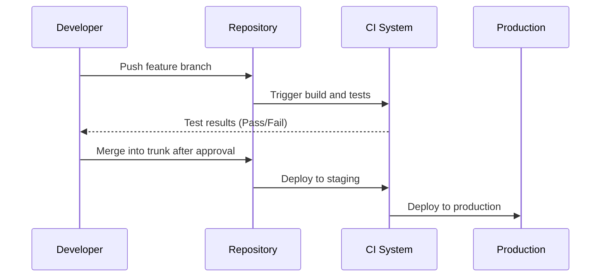

# Trunk-Based Deployment Guide

## Table of Contents

- [Trunk-Based Deployment Guide](#trunk-based-deployment-guide)
  - [Table of Contents](#table-of-contents)
  - [Introduction](#introduction)
    - [Why Use Trunk-Based Development?](#why-use-trunk-based-development)
  - [Key Concepts](#key-concepts)
    - [Trunk](#trunk)
    - [Short-Lived Feature Branches](#short-lived-feature-branches)
    - [Continuous Integration (CI)](#continuous-integration-ci)
    - [Continuous Deployment (CD)](#continuous-deployment-cd)
  - [Branching Strategy](#branching-strategy)
    - [Guidelines](#guidelines)
  - [Deployment Workflow](#deployment-workflow)
    - [1. Development](#1-development)
    - [2. Continuous Integration (CI)](#2-continuous-integration-ci)
    - [3. Code Review \& Merge](#3-code-review--merge)
    - [4. Continuous Deployment (CD)](#4-continuous-deployment-cd)
  - [Automated Testing and CI/CD](#automated-testing-and-cicd)
  - [Best Practices](#best-practices)
  - [Troubleshooting Common Issues](#troubleshooting-common-issues)
  - [Glossary](#glossary)
  - [References](#references)

---

## Introduction

Trunk-based deployment is a modern software development strategy where all developers commit to a single shared branch, commonly called **trunk** or **main**. This approach enhances collaboration, reduces integration complexity, and allows for faster and more reliable deployments.

### Why Use Trunk-Based Development?

- Reduces merge conflicts by integrating changes frequently.
- Enables **Continuous Integration (CI)** and **Continuous Deployment (CD)**.
- Promotes code quality with automated testing and short-lived feature branches.
- Supports a **DevOps culture** by reducing hand-offs between teams.

## Key Concepts

### Trunk

- The **main branch** where all developers commit their changes.
- Kept in a deployable state at all times.

### Short-Lived Feature Branches

- Branches created from **trunk** for feature development.
- Merged back into trunk within a short time (ideally 1-2 days).

### Continuous Integration (CI)

- Developers push code frequently.
- Automated tests ensure trunk stability.

### Continuous Deployment (CD)

- Trunk is always in a deployable state.
- Code changes are released to production frequently.

## Branching Strategy

A simple branching model is followed:

```mermaid
graph TD;
    A[Trunk (Main)] -->|Short-lived feature branches| B[Feature Branch 1]
    A --> C[Feature Branch 2]
    B -->|Merge back quickly| A
    C -->|Merge back quickly| A
```

### Guidelines

- Keep feature branches **short-lived** (merge within a few days).
- Regularly pull updates from **trunk** to avoid drift.
- Use **feature flags** to manage incomplete features in production.

## Deployment Workflow

### 1. Development

- Developers create a **feature branch** from trunk.
- Write code and ensure unit tests pass.

### 2. Continuous Integration (CI)

- Push changes to **feature branch**.
- Run automated tests to ensure correctness.

### 3. Code Review & Merge

- Open a **pull request (PR)** to trunk.
- Conduct code reviews and merge changes quickly.

### 4. Continuous Deployment (CD)

- Automated deployment process triggered when code is merged to trunk.
- Use feature flags for unfinished features.



## Automated Testing and CI/CD

To maintain stability, a **CI/CD pipeline** is essential:

1. **Pre-merge Checks**

   - Linting and static analysis
   - Unit tests

2. **Post-merge Validations**

   - Integration tests
   - Regression tests

3. **Deployment Steps**

   - Deploy to **staging** first
   - Deploy to **production** after approval

## Best Practices

- **Always commit to trunk frequently**.
- **Feature branches should not live long** (preferably less than a week).
- **Automate tests** to catch errors early.
- **Monitor deployments** for issues.
- **Use feature flags** instead of long-lived branches.

## Troubleshooting Common Issues

| Issue             | Cause                | Solution                              |
| ----------------- | -------------------- | ------------------------------------- |
| Merge conflicts   | Long-lived branches  | Keep branches short, merge frequently |
| Broken deployment | Insufficient testing | Strengthen CI/CD checks               |
| Rollback needed   | Bug in production    | Use feature flags to toggle changes   |

## Glossary

- **Trunk**: The main branch where all developers integrate their changes.
- **Feature Branch**: A temporary branch for implementing a new feature.
- **CI/CD**: Continuous Integration and Continuous Deployment.
- **Feature Flags**: A method to enable/disable features in production.

## References

- [Trunk-Based Development - Martin Fowler](https://martinfowler.com/articles/branching-patterns.html)
- [Google Engineering Best Practices](https://opensource.google/docs/releasing/branching/)
